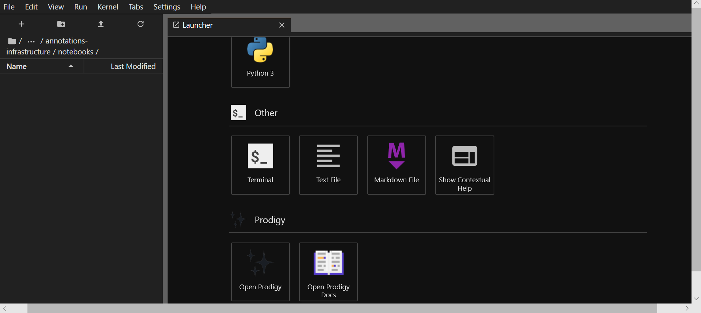
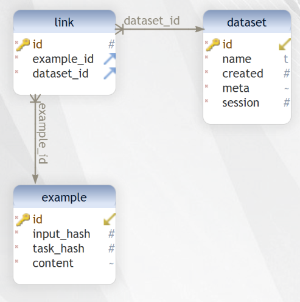
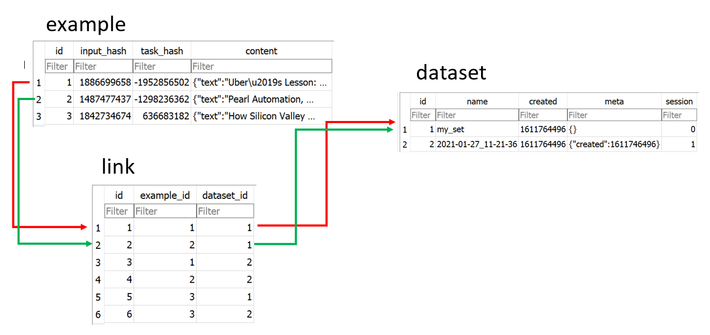

# Annotations Infrastructure
## Justin A. Gould (gould29@purdue.edu)
## January 2021

# Named Entity Recognition
I love [this definition](https://medium.com/mysuperai/what-is-named-entity-recognition-ner-and-how-can-i-use-it-2b68cf6f545d) of named entity recognition (NER):
> Named entity recognition (NER) — sometimes referred to as entity chunking, extraction, or identification — is the task of identifying and categorizing key information (entities) in text. An entity can be any word or series of words that consistently refers to the same thing. Every detected entity is classified into a predetermined category. For example, an NER machine learning (ML) model might detect the word “super.AI” in a text and classify it as a “Company”.

> NER is a form of natural language processing (NLP), a subfield of artificial intelligence. NLP is concerned with computers processing and analyzing natural language, i.e., any language that has developed naturally, rather than artificially, such as with computer coding languages.


# Documentation
Check out [Prodigy's NER documentation](https://prodi.gy/docs/recipes#ner) for more details.


## 📋 Usage
While we feel using a JupyterLab session is an effective way to launch and use Prodigy, this is not required.

Start a Prodigy session in a terminal, e.g.:

```console
python -m prodigy ner.manual my_set blank:en ./news_headlines.jsonl --label PERSON,ORG,PRODUCT
```
Where:
- `ner.manual` (recipe): Mark entity spans in a text by highlighting them and selecting the respective labels. The model is used to tokenize the text to allow less sensitive highlighting, since the token boundaries are used to set the entity spans. The label set can be defined as a comma-separated list on the command line or as a path to a text file with one label per line. If no labels are specified, Prodigy will check if labels are present in the model. This recipe does not require an entity recognizer, and doesn’t do any active learning.
- `my_set` (dateset name reflected in db): The annotations will be saved to a table with this name in `$PRODIGY_HOME/prodigy.db`. Please see below for information on the database schema.
- `blank:en` (spacy_model): Loadable [spaCy model](https://spacy.io/models) for tokenization or `blank:lang` for a blank model (e.g. `blank:en` for English).
- `./news_headlines.jsonl` (data to annotate): Path to text source (`.jsonl` preferred)
- `--label PERSON,ORG,PRODUCT` (labels to annotate): Labels for users to annotate in the source text

For more information on NER "recipes" (command like `ner.manual`), see [the docs](https://prodi.gy/docs/recipes#ner).

To run Prodigy _without_ Jupyter Lab, navigate to the following in a browser:
```
http://localhost:8080
```

However, to run the JupyterLab extension, in another terminal session, start JupyterLab:

```console
jupyter lab
```

Then, inside of JupyterLab, open the `Commands` on the left sidebar, and search/type:
<kbd>Open Prodigy</kbd>

Execute it--or click the button, as depicted below--and you will have a new Prodigy panel on the side:


Alternatively, within a notebook on JupyterLab--or in the available terminal, you can use the console command listed above to start a Prodigy session to open the UI within your JupyterLab session, as depicted here:


**_Things to keep in mind:_**
- The `ner.manual` recipe is for finetuning blank or existing spaCy model. To annotate for using BERT, read [this document](https://prodi.gy/docs/named-entity-recognition#transformers-tokenizers). **TL;DR:** You need to be careful which `recipe` you use, and select the correct one for the task you need.

To use Prodigy for NER for efficient annotaton for transformer architecture:
```
python -m prodigy bert.ner.manual ner_reddit ./reddit_comments.jsonl --label PERSON,ORG --tokenizer-vocab ./bert-base-uncased-vocab.txt --hide-wp-prefix -F transformers_tokenizers.py
```
Transformer models like BERT typically use subword tokenization algorithms like WordPiece or Byte Pair Encoding (BPE) that are optimized for efficient embedding of large vocabularies and not necessarily linguistic definitions of what’s considered a “word”. If you’re creating training data for **fine-tuning a transformer**, you can use its tokenizer to preprocess your texts to make sure that the data you annotate is compatible with the **transformer tokenization**. It also makes annotation faster, because your selection can snap to token boundaries. The following recipe implementation uses Hugging Face’s easy-to-use [`tokenizers` library](https://github.com/huggingface/tokenizers) under the hood and you can adjust it for your custom tokenization needs.

## ⚙ Configuration

If your Prodigy is being served at a URL different than the default (e.g. behind a reverse proxy) you can configure the URL to use in the settings.

Open the `Settings` menu, go to `Advanced Settings Editor`, select the settings for `Prodigy Jupyter Extension`, and there you can add your custom URL, e.g.:

```JSON
{
    "prodigyConfig": {
        "url": "https://prodigy.example.com"
    }
}
```

## Accessing Annotated Data
As mentioned avove, the annotated data are saved to `$PRODIGY_HOME/prodigy.db`, where the table name is defined in the command to start Prodigy (e.g., `my_set` in the first example.)

The database's schema:



When you start a new Prodigy session, the `source` value (e.g., `my_set`) will be reflected as a row in `dataset`.

Every annotation is saved as a unique row in `example`, which is linked to the dataset, via the `link` table. For example:



## Example Usage
You will find a copy of `prodigy.db` as an example, to show what I have done for this demo.

### Tables and Descriptions
- `my_set`
    - This is the default example from the Prodigy documentation--using the [sample news headline data](https://github.com/gouldju1/annotations-infrastructure/blob/NER/resources/news_headlines.jsonl) to annotate for a blank English spaCy model.
    ```
    python -m prodigy ner.manual my_set blank:en ./news_headlines.jsonl --label PERSON,ORG,PRODUCT
    ```
- `bert_Example`
    - This is a modification of the previous example. Instead of using a blank spaCy model, I am using the BERT-specific `recipe` for fine-tuning transformers.
    ```
    python -m prodigy bert.ner.manual bert_Example ./news_headlines.jsonl --label PERSON,ORG,PRODUCT --tokenizer-vocab ./bert-base-uncased-vocab.txt --hide-wp-prefix -F transformers_tokenizers.py --lowercase
    ```
    Tips:
    - You can use `wget "https://s3.amazonaws.com/models.huggingface.co/bert/bert-base-uncased-vocab.txt" -O "bert-base-uncased-vocab.txt"` to get the vocabulary file for the BERT tokenizer (the `wget` will have you download it directly from Hugging Face; however, I included it in the repository under `./resources`.)
    - You can use `wget "https://raw.githubusercontent.com/explosion/prodigy-recipes/master/other/transformers_tokenizers.py" -O "transformers_tokenizers.py"` to get the recipe for transformers (the `wget` will have you download it directly from Explosion AI; however, I included it in the repository under `./resources`.)
    - You need to keep `--lowercase` flag for the tokenizer to work; otherwise your tokens will be OOV, and represented by `[UNK]`.

# How do the Output Data Look?
_Also see `./resources/annotation_examples`_
SpaCy Example:
```
{
    "text": "Pearl Automation, Founded by Apple Veterans, Shuts Down",
    "meta": {
        "source": "The New York Times"
    },
    "tokens": [
        {
            "text": "[CLS]",
            "id": 0,
            "start": 0,
            "end": 0,
            "tokenizer_id": 101,
            "disabled": true,
            "ws": true
        },
        {
            "text": "pearl",
            "id": 1,
            "start": 0,
            "end": 5,
            "tokenizer_id": 7247,
            "disabled": false,
            "ws": true
        },
        {
            "text": "automation",
            "id": 2,
            "start": 6,
            "end": 16,
            "tokenizer_id": 19309,
            "disabled": false,
            "ws": false
        },
        {
            "text": ",",
            "id": 3,
            "start": 16,
            "end": 17,
            "tokenizer_id": 1010,
            "disabled": false,
            "ws": true
        },
        {
            "text": "founded",
            "id": 4,
            "start": 18,
            "end": 25,
            "tokenizer_id": 2631,
            "disabled": false,
            "ws": true
        },
        {
            "text": "by",
            "id": 5,
            "start": 26,
            "end": 28,
            "tokenizer_id": 2011,
            "disabled": false,
            "ws": true
        },
        {
            "text": "apple",
            "id": 6,
            "start": 29,
            "end": 34,
            "tokenizer_id": 6207,
            "disabled": false,
            "ws": true
        },
        {
            "text": "veterans",
            "id": 7,
            "start": 35,
            "end": 43,
            "tokenizer_id": 8244,
            "disabled": false,
            "ws": false
        },
        {
            "text": ",",
            "id": 8,
            "start": 43,
            "end": 44,
            "tokenizer_id": 1010,
            "disabled": false,
            "ws": true
        },
        {
            "text": "shut",
            "id": 9,
            "start": 45,
            "end": 49,
            "tokenizer_id": 3844,
            "disabled": false,
            "ws": false
        },
        {
            "text": "s",
            "id": 10,
            "start": 49,
            "end": 50,
            "tokenizer_id": 2015,
            "disabled": false,
            "ws": true
        },
        {
            "text": "down",
            "id": 11,
            "start": 51,
            "end": 55,
            "tokenizer_id": 2091,
            "disabled": false,
            "ws": true
        },
        {
            "text": "[SEP]",
            "id": 12,
            "start": 0,
            "end": 0,
            "tokenizer_id": 102,
            "disabled": true,
            "ws": true
        }
    ],
    "_input_hash": 1487477437,
    "_task_hash": 305312124,
    "_session_id": null,
    "_view_id": "ner_manual",
    "spans": [
        {
            "start": 0,
            "end": 16,
            "token_start": 1,
            "token_end": 2,
            "label": "ORG"
        },
        {
            "start": 29,
            "end": 43,
            "token_start": 6,
            "token_end": 7,
            "label": "PERSON"
        }
    ],
    "answer": "accept"
}
```

BERT Example:
```
{
    "text": "Tim O'Reilly Explains the Internet of Things",
    "meta": {
        "source": "The New York Times"
    },
    "tokens": [
        {
            "text": "[CLS]",
            "id": 0,
            "start": 0,
            "end": 0,
            "tokenizer_id": 101,
            "disabled": true,
            "ws": true
        },
        {
            "text": "tim",
            "id": 1,
            "start": 0,
            "end": 3,
            "tokenizer_id": 5199,
            "disabled": false,
            "ws": true
        },
        {
            "text": "o",
            "id": 2,
            "start": 4,
            "end": 5,
            "tokenizer_id": 1051,
            "disabled": false,
            "ws": false
        },
        {
            "text": "'",
            "id": 3,
            "start": 5,
            "end": 6,
            "tokenizer_id": 1005,
            "disabled": false,
            "ws": false
        },
        {
            "text": "reilly",
            "id": 4,
            "start": 6,
            "end": 12,
            "tokenizer_id": 13875,
            "disabled": false,
            "ws": true
        },
        {
            "text": "explains",
            "id": 5,
            "start": 13,
            "end": 21,
            "tokenizer_id": 7607,
            "disabled": false,
            "ws": true
        },
        {
            "text": "the",
            "id": 6,
            "start": 22,
            "end": 25,
            "tokenizer_id": 1996,
            "disabled": false,
            "ws": true
        },
        {
            "text": "internet",
            "id": 7,
            "start": 26,
            "end": 34,
            "tokenizer_id": 4274,
            "disabled": false,
            "ws": true
        },
        {
            "text": "of",
            "id": 8,
            "start": 35,
            "end": 37,
            "tokenizer_id": 1997,
            "disabled": false,
            "ws": true
        },
        {
            "text": "things",
            "id": 9,
            "start": 38,
            "end": 44,
            "tokenizer_id": 2477,
            "disabled": false,
            "ws": true
        },
        {
            "text": "[SEP]",
            "id": 10,
            "start": 0,
            "end": 0,
            "tokenizer_id": 102,
            "disabled": true,
            "ws": true
        }
    ],
    "_input_hash": 1960221200,
    "_task_hash": 1177653066,
    "_session_id": null,
    "_view_id": "ner_manual",
    "spans": [
        {
            "start": 0,
            "end": 12,
            "token_start": 1,
            "token_end": 4,
            "label": "PERSON"
        },
        {
            "start": 26,
            "end": 44,
            "token_start": 7,
            "token_end": 9,
            "label": "PRODUCT"
        }
    ],
    "answer": "accept"
}
```